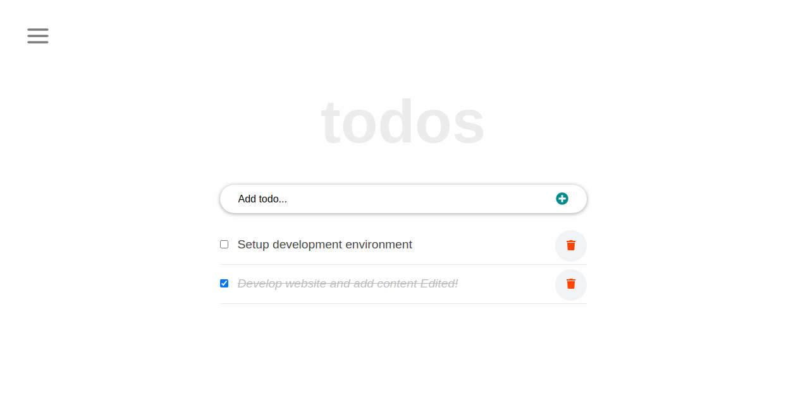

# Math Magicians App

> A React to do app that allows the user to add, remove and edit tasks




**This is a Single Page App (SPA) that allows users to:**
- Add, remove and edit tasks.

**Features:**
- To do tasks saved to local storage.
- Implemented React Router.


## Built With

- HTML
- CSS
- JavaScript
- React

## Live Page

[Page Link](https://helio3197.github.io/react-to-do/build/)


## Getting Started

To get a local copy up and running follow these simple steps.

### Prerequisites

- Have git correctly installed.
- Have NPM and NodeJs correctly installed.

### Setup

- Open a terminal window where you want to have installed a copy of the repository.

### Install

- Use this command to clone the repo:
```
$ git clone git@github.com:helio3197/react-to-do.git
```
- Install the required dependencies:
```
$ npm install
```
### Usage

- Run:
```
$ npm start
```
- Build:
```
$ npm run build
```
- Testing:
```
$ npm test
```
- Edit the content as you like.


## Authors

👤 **Kenny Salazar**

- GitHub: [@helio3197](https://github.com/helio3197)
- Twitter: [@kennysalazar31](https://twitter.com/kennysalazar31)
- LinkedIn: [LinkedIn](https://linkedin.com/in/kenny-salazar-1a1687110)


## 🤝 Contributing

Contributions, issues, and feature requests are welcome!

Feel free to check the [issues page](../../issues/).

## Show your support

Give a ⭐️ if you like this project!

## Acknowledgments

- Thanks to Microverse for the guidelines.


## 📝 License

This project is [MIT](./MIT.md) licensed.
